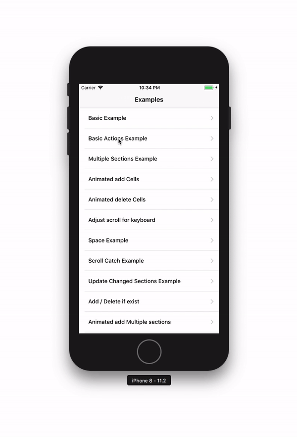
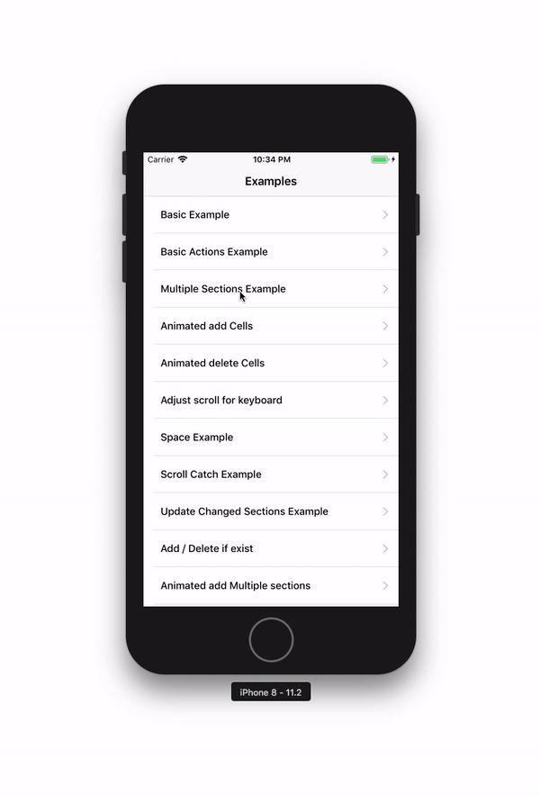
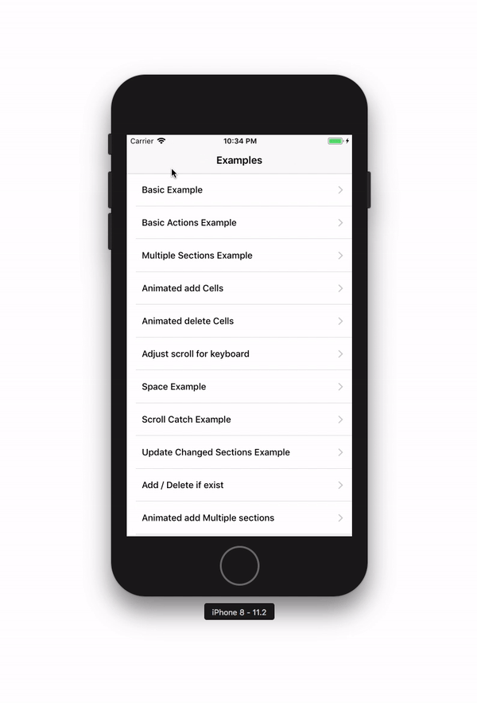

An wrapper around **UITableView** which aims to facilitate working with tables.


- [Onboarding](#onboarding)
- [Implementation Example](#implementation-example)
- [Templates](#templates)
- [Snippets](#snippets)
- [Requirements](#requirements)
- [Installation](#installation)

## Onboarding
To start use **ImoTableView** you need to undesrstand the base concept, **ImoTableView** is composed from four classes.

1. **ImoTableView** is an subclass from **UITableView** and have the role to manage with **ImoTableViewSection**'s, add new sections, delete and update them.
2. **ImoTableViewSection** is an class which work with **ImoTableViewSource**'s, add new source, delete, update.
3. **ImoTableViewSource** is base object for your new **CellSource**'s this source contain base info about cell class, cell height, and other aditional proprietes which you want to show in your cell, user name for example.
4. **ImoTableViewCell** is view representation of properties you have stored in your source.


## Implementation Example

Example of how quick and simple you can add an populate an tableView
This is how ```swift ViewController.swift ``` looks like
```swift
//Create an table andd ad on SomeUIView
let tableView = ImoTableView(on: someUIView, insets: UIEdgeInsets(top: 20, left: 0, bottom: 0, right: 0))
//Create new section
let section = ImoTableViewSection()
//Create new cellSource
let actionCellSource = ActionCellSource(title: "Action")
//Add cellSource to section
section.add(actionCellSource)
//Add section to table View
tableView.add(section)
//Reload table
tableView.reloadData()
```

`ActionCell.swift` Contain an method ```swift open override func setUpWithSource(source:AnyObject)``` and this method is called every time  **ActionCell** will be shown on screen and ```swift source:AnyObject``` is cell source with all properties you need to set up you cell.

```swift
open class ActionCell: ImoTableViewCell {
    //UILabel from ActionCell.xib
    @IBOutlet weak var actionTitle: UILabel!
    //This method is called every time your cell will be displayed on screen
    open override func setUpWithSource(source: AnyObject) {
        //Cast source to ActionCellSource
        if let source = source as? ActionCellSource {
            //Set the label title
            self.actionTitle.text = source.title
        }
    }
}
```
`ActionCellSource.swift` Contain an method ```swift open override func setUpWithSource(source:AnyObject)``` and this method is called every time  **ActionCell** will be shown on screen and ```swift source:AnyObject``` is cell source with all properties you need to set up you cell.

```swift
open class ActionCellSource: ImoTableViewSource {

    public var title: String

    init(title: String) {
        self.title = title
        //Init source an specify cell class you will represent by this source
        super.init(cellClass: "ActionCell")
        //Set nib bundle if your cell is not in current project bundle
        setNibBundle(with:Bundle.init(for: self.classForCoder))
    }
}
```

## Templates
The quick onboarding for use **ImoTableView** is to add **ImoTableViewCell.xctemplate** in your xcode templates, this template will create all you need to fast create an new **Cell** and **CellSource** for you


To add **ImoTableViewCell.xctemplate.xctemplate** in xcode you need to open File Templates folder, you can simply call this terminal command ```open /Applications/Xcode.app/Contents/Developer/Library/Xcode/Templates/File\ Templates/```

After create an folder **ImoTableView** and copy in this folder **ImoTableViewCell.xctemplate** from Templates/ folder of this repo.

## Snippets
### ImoTableViewSection

```swift
//Create new section
let section = ImoTableViewSection()

//Add CellSource
section.add(yourCellSource)

//Delete CellSource
section.delete(atIndex: yourCellIndex)

//Delete CellSource
section.delete(yourCellSource)

//Delete All
section.deleteAll()

//Set section header View
section.headerView = YourView

//Set section footer View
section.footerView = YourView

```

### ImoTableView

```swift
//Create new table
let table = ImoTableView()

//Add section
table.add(yourSection)

//Add sections
table.add(yourSections)

//Delete section at index
table.deleteSection(at: yourSectionIndex)

//Delete all sections
table.deleteAllSections()

//Did select source, after user touch up on cell
table.didSelectSource = { source in
    //Do something with source
}

//Did select cell at index path, after user touch up on cell
table.didSelectCellAtIndexPath = { indexPath in
    //Do something with source
}

```

## Requirements

- iOS 8.0+
- Xcode 8.1+
- Swift 3.1+

## Installation

### Carthage

[Carthage](https://github.com/Carthage/Carthage) is a decentralized dependency manager that builds your dependencies and provides you with binary frameworks.

You can install Carthage with [Homebrew](http://brew.sh/) using the following command:

```bash
$ brew update
$ brew install carthage
```

To integrate ImoTableView into your Xcode project using Carthage, specify it in your `Cartfile`:

```ogdl
github "imodeveloperlab/ImoTableView" ~> 1.0
```

Run `carthage update` to build the framework and drag the built `ImoTableView.framework` into your Xcode project.


### CocoaPods

[CocoaPods](http://cocoapods.org) is a dependency manager for Cocoa projects. You can install it with the following command:

```bash
$ gem install cocoapods
```

> CocoaPods 1.1.0+ is required to build ImoTableView 1.0.8+.

To integrate ImoTableView into your Xcode project using CocoaPods, specify it in your `Podfile`:

```ruby
source 'https://github.com/CocoaPods/Specs.git'
platform :ios, '10.0'
use_frameworks!

target '<Your Target Name>' do
    pod 'ImoTableView', '~> 1.0.25'
end
```

Then, run the following command:

```bash
$ pod install
```

## Examples

### Basic Example

```swift
//TABLE
let table = ImoTableView(on: self.view)

//SECTION
let section = ImoTableViewSection()

//FAKER
let faker = Faker.init()

let firstName = TextCellSource(text: "First Name: \(faker.name.firstName())")
section.add(firstName)

let lastName = TextCellSource(text: "Last Name: \(faker.name.lastName())")
section.add(lastName)

let company = TextCellSource(text: "Company: \(faker.company.name())")
section.add(company)

table.add(section: section)
```


### Basic Actions Example

```swift
override func viewDidLoad() {

        super.viewDidLoad()

        //TABLE
        let table = ImoTableView(on: self.view)

        //SECTION
        let section = ImoTableViewSection()

        //FAKER
        let faker = Faker.init()

        //1. First way
        let appNameCell = ActionCellSource(title: "App name: \(faker.app.name())")
        section.add(appNameCell, target: self, #selector(didSelectAppName))

        //2. Second way
        let appAuthorCell = ActionCellSource(title: "Author: \(faker.app.author())")
        appAuthorCell.target = self
        appAuthorCell.selector = #selector(didSelectAppAuthor)
        section.add(appAuthorCell)

        //3. Third way
        let appVersion = faker.app.version()
        let appVersionCell = ActionCellSource(title: "App version: \(appVersion)")
        appVersionCell.target = self
        appVersionCell.object = appVersion as AnyObject
        appVersionCell.selector = #selector(didSelectAppVersion)
        section.add(appVersionCell)

        table.add(section: section)
}

func didSelectAppVersion(sender: AnyObject) {

    let version = sender as! String
    show(message: "Did select version \(version)")
}

func didSelectAppAuthor() {

    self.show(message: "Did select app author")
}

func didSelectAppName() {

    show(message: "Did select app name")
}
```


### Multiple Sections Example

```swift
//TABLE
let table = ImoTableView(on: self.view)

//USER INFO SECTION
let userInfoSection = ImoTableViewSection()
userInfoSection.headerTitle = "User info"

let firstName = TextCellSource(text: "First Name: \(faker.name.firstName())")
userInfoSection.add(firstName)

let lastName = TextCellSource(text: "Last Name: \(faker.name.lastName())")
userInfoSection.add(lastName)
table.add(section: userInfoSection)

//BUSSINES INFO SECTION
let bussinesInfoSection = ImoTableViewSection()
bussinesInfoSection.headerTitle = "Bussines info"

let company = TextCellSource(text: "Company: \(faker.company.name())")
bussinesInfoSection.add(company)

let cardNumber = TextCellSource(text: "Credit Card: \(faker.business.creditCardNumber())")
bussinesInfoSection.add(cardNumber)

let cardType = TextCellSource(text: "Type: \(faker.business.creditCardType())")
bussinesInfoSection.add(cardType)
table.add(section: bussinesInfoSection)

//Lorem section
let loremSection = ImoTableViewSection()
loremSection.headerTitle = "Lorem Ipsum"

for _ in 0...20 {
    let text = faker.lorem.sentence()
    loremSection.add(TextCellSource(text: text))
}

table.add(section: loremSection)
```


### Animate Add Cells Example

```swift
override func viewDidLoad() {

  super.viewDidLoad()

  //HIDE THE KAYBOARD WHEN TAPPED ARROUND
  self.hideKeyboardWhenTappedAround()

  //TABLE
  self.table = ImoTableView(on: self.view)

  //ADD ONE CELL ACTION
  let addSource = ActionCellSource(title: "Add new Cell")
  mainSection.add(addSource, target: self, #selector(addNewCell))

  //ADD MULTIPLE CELL'S ACTION
  let addMultipleSource = ActionCellSource(title: "Add multiple Cells")
  mainSection.add(addMultipleSource, target: self, #selector(addMultipleCells))

  //HEADER TITLE
  secondSection.headerTitle = "Cells"

  //ADD SECTIONS TO TABLE
  table.add(section: mainSection)
  table.add(section: secondSection)
}

func addNewCell() {

  let text = faker.lorem.sentence()
  let source = TextCellSource(text: text)
  table.add(source: source, in: secondSection, animated: true, animation: .top)
}

func addMultipleCells() {

  var sources:[TextCellSource] = []

  for _ in 0...10 {
      let text = faker.lorem.sentence()
      sources.append(TextCellSource(text: text))
  }

  table.add(sources: sources, in: secondSection, animated: true, animation: .top)
}
```


### Animate Delete Cells Example

```swift
override func viewDidLoad() {

    super.viewDidLoad()
    self.hideKeyboardWhenTappedAround()
    self.table = ImoTableView(on: self.view)

    let deleteFirstSource = ActionCellSource(title: "Delete first cell")
    mainSection.add(deleteFirstSource, target: self, #selector(deleteFirst))

    let deleteLastSource = ActionCellSource(title: "Delete last cell")
    mainSection.add(deleteLastSource, target: self, #selector(deleteLast))

    let deleteAllSource = ActionCellSource(title: "Delete all cells")
    mainSection.add(deleteAllSource, target: self, #selector(deleteAll))

    secondSection.headerTitle = "Cells"

    addMultipleCells()

    table.add(section: mainSection)
    table.add(section: secondSection)
}

func addMultipleCells() {

    var sources:[TextCellSource] = []

    for _ in 0...5 {
        let text = faker.lorem.sentence()
        sources.append(TextCellSource(text: text))
    }

    secondSection.add(sources: sources)
}

func deleteFirst()  {

    if let source = secondSection.firstSource() {
        table.delete(source: source, in: secondSection, animated: true, animation: .left)
    }
}

func deleteLast()  {

    if let source = secondSection.lastSource() {
        table.delete(source: source, in: secondSection, animated: true, animation: .right)
    }
}

func deleteAll()  {

    let allSources = secondSection.allSources()
    table.delete(sources: allSources, in: secondSection, animated: true, animation: .top)
}
```


### Animate Delete Cells Example

```swift
self.hideKeyboardWhenTappedAround()
let table = ImoTableView(on: self.view, insets: UIEdgeInsets(top: 0, left: 0, bottom: 0, right: 0))

table.tableView.contentInset = UIEdgeInsets(top: 100, left: 0, bottom: 60, right: 0)
table.tableView.scrollIndicatorInsets = UIEdgeInsets(top: 100, left: 0, bottom: 60, right: 0)

table.adjustContentInsetsForKeyboard(true)
let section = ImoTableViewSection()

for _ in 0...5 {
    let textField = TextFieldCellSource(staticCellWithTableView: table)
    section.add(textField)
}

for _ in 0...20 {
    let text = faker.lorem.sentence()
    section.add(TextCellSource(text:text))
}

table.add(section: section)
```

